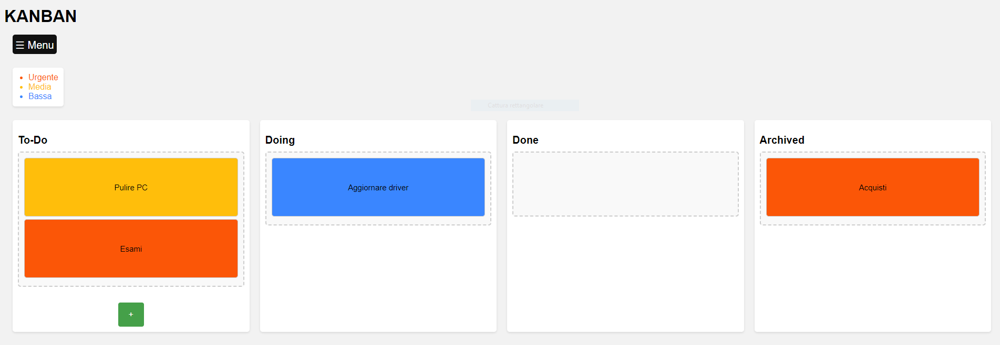

<div align="center">
  <a href="https://github.com/alexbagiacchii/kanban">

  </a>

  <h3 align="center">KANBAN</h3>

  <p align="center">
    Organizza le tue attività in modo semplice e veloce.
    <br />
    <a href="https://github.com/alexbagiacchii/kanban"><strong>« Esplora il progetto »</strong></a>
    <br />
    <br />
    <a href="https://github.com/alexbagiacchii/kanban/tree/master/demo">Guarda la demo</a>
  </p>
</div>

<details>
  <summary>Elenco contenuti</summary>
  <ol>
    <li> 
      <a href="#progetto">Progetto</a>
      <ul>
        <li><a href="#linguaggi-utilizzati">Linguaggi utilizzati</a></li>
      </ul>
    </li>
    <li>
      <a href="#per-iniziare">Per iniziare</a>
      <ul>
        <li><a href="#prerequisiti">Prerequisiti</a></li>
        <li><a href="#installazione">Installazione</a></li>
      </ul>
    </li>
    <li><a href="#utilizzo">Utilizzo</a></li>
    <li><a href="#implementazioni">Implementazioni</a></li>
    <li><a href="#contributi">Contributing</a></li>
    <li><a href="#licenza">License</a></li>
    <li><a href="#contatto">Contact</a></li>
    <li><a href="#ringraziamenti">Acknowledgments</a></li>
  </ol>
</details>

<!-- ABOUT THE PROJECT -->
## Progetto
### Home.php
[](https://github.com/alexbagiacchii/kanban/demo/demo-menu.png)

### Login.php
[](https://github.com/alexbagiacchii/kanban/demo/demo-menu.png)

KanBoard è un’applicazione web progettata per aiutare gli utenti a organizzare i propri compiti utilizzando la metodologia Kanban. Con KanBoard, puoi gestire facilmente i tuoi compiti in modo visuale ed efficiente.

### Funzionalità:
* Gestione Task: Crea, modifica ed elimina le task senza sforzo.
* Gestione Utenti: Registra e elimina qualsiasi utente.
* Modifica Task: Modifica le tue task in qualsiasi momento.
* Interfaccia Drag and Drop: Sposta le task negli stati con un semplice trascinamento.
* Cronologia: Hai a disposizione l'elenco delle modifiche per tenere traccia di tutte le azioni.
* Livelli di Priorità: Assegna livelli di priorità ai compiti per una migliore organizzazione.
* Autenticazione Utente: Sistema di login sicuro per garantire la privacy dei dati.
* Design Responsive: Accedi a KanBoard da qualsiasi dispositivo, che sia un desktop o uno smartphone.


### Programmato con 

* [](https://www.javascript.com)
* [](https://html.com)
* [](https://www.w3.org/Style/CSS/Overview.en.html)
* [](https://www.php.net)
* [](https://dev.mysql.com)


<!-- GETTING STARTED -->
## Per iniziare

Per iniziare a utilizzare KanBoard segui questi passaggi:

### Pre-requisiti

Consiglio: XAMPP viene utilizzato per creare un web hosting locale sul proprio computer grazie ad una distribuzione facile da installare; è particolarmente usato per scopi di testing nella programmazione web.
* Download Xampp
  ```sh
  https://www.apachefriends.org/download.html
  ```

### Installazione

Dopo aver installato Xampp segui questi passaggi:

1. Percorso (se Xampp installato in C:)
   ```sh
   C:\xampp\htdocs
   ```
2. Clona il repository in `xampp\htdocs`
   ```sh
   git clone https://github.com/alexbagiacchii/kanban.git
   ```
3. Start `xampp-control.exe`
   ```sh
   C:\xampp\xampp-control.exe
   Action: START MySQL & START Apache 
   Test: localhost 
   ```
4. Carica DataBase `kanban.sql`
   ```sh
   localhost
   phpmyadmin
   create database - "kanban"
   operations
   carica db: kanban\db\kanban.sql
   ```
5. Usa KanBan
   ```js
   localhost/kanban/login/login.php
   ```


## Utilizzo

Una volta avviato KanBoard, puoi:

* Accedere o registrarti.
* Recuperare la password.
* Creare nuovi compiti cliccando sul pulsante “+”.
* Trascinare i compiti tra le colonne “Da Fare,” “In Corso,” “Completati,” e “Archiviati.”
* Fare clic su un compito per visualizzare i dettagli, inclusi titolo, descrizione, priorità e altro.
* Modificare i compiti cliccando sul pulsante “Modifica” e apportare le modifiche necessarie.
* Visualizzare gli utenti registrati, inserirne di nuovi ed eliminarli.
* Visualizzare la cronologia di tutte le attività svolte.


<!-- ROADMAP -->
## Implementazioni

- [x] Aggiunta modifica task
- [x] Aggiunta eliminazione utenti
- [ ] Dark mode
- [ ] Recupero ultima attività
- [ ] Ruoli multi-utente
    - [ ] Admin
    - [ ] User
    - [ ] Just-look
     

<!-- CONTRIBUTING -->
## Contributi

I contributi a KanBoard sono i benvenuti! Se hai idee per miglioramenti o nuove funzionalità, non esitare a aprire un problema o a inviare una richiesta di pull.


## Licenza

Tutti i diritti riservati.

Questo progetto è stato creato come parte di un lavoro scolastico e può essere utilizzato solo a scopo educativo. È vietato l'uso commerciale o la distribuzione senza il consenso esplicito dell'autore.

L'autore non fornisce alcuna garanzia sul funzionamento o sulla qualità del codice fornito.

© [2024] [Alexandru Bagiacchi]

